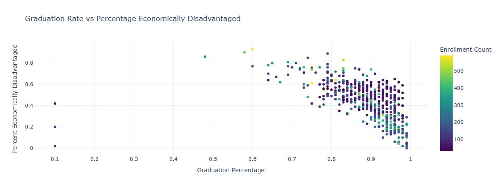

# District-Level Drivers of Academic and Graduation Outcomes in New York State

What factors are associated with district-level graduation outcomes and academic performance in New York State?

## Objective

Evaluate structural, demographic, and academic factors associated with district-level graduation rates.

## How to run

1. Download the relevant data (see below) from here: https://data.nysed.gov/downloads.php. Or use the following links to download the data directly.
    - [Report Card Database (~270MB)](https://data.nysed.gov/files/essa/24-25/SRC2025.zip)
    - [Enrollment Database (~7MB)](https://data.nysed.gov/files/enrollment/24-25/ENROLLMENT_2025.zip)
    - [Graduation Rate Database (~8MB)](https://data.nysed.gov/files/gradrate/24-25/gradrate.zip)

2. Install all required libraries using `requirements.txt`.

3. Create `@/data/raw`, `@/data/processed`, and `@/results` directories in the root directory if not already present.

4. Place all the unzipped versions of the downloaded datasets into the `@/data/raw` directory.

5. Run all notebooks in order specified.

## Research Questions

### 1. Is there a correlation between graduation rates and number of economically disadvantaged students in each district?

The relationship is as expected - higher graduation rate correlates with lower percentage of economically disadvantaged students per district.

(Each point is a NY school district)

### 2. What are the grade distributions for charter vs non-charter schools in each subject (ridgeline plot)?
